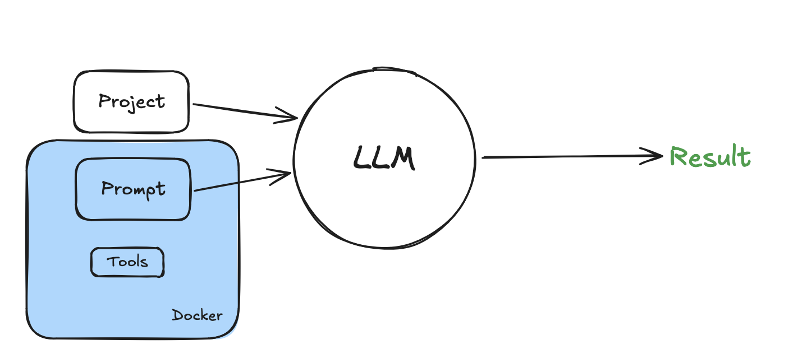
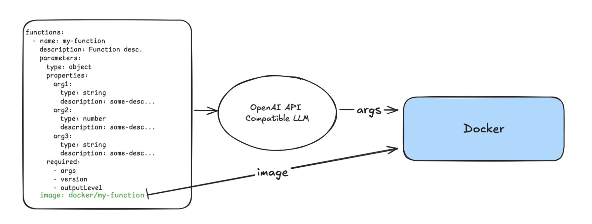
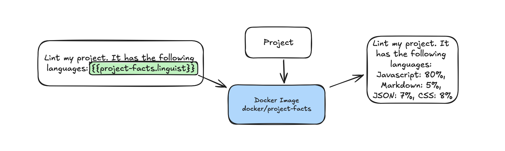
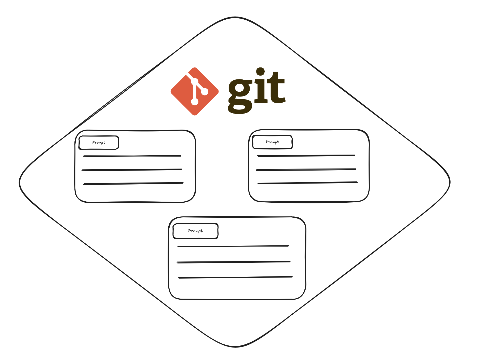

<!---
---
tools:
  - name: curl
---
-->

**This README is an agentic workflow**

# AI Tools for Developers

Agentic AI workflows enabled by Docker containers.

Just Docker. Just Markdown. BYOLLM.

## MCP
Any prompts you write and their tools can now be used as [MCP servers](https://www.anthropic.com/news/model-context-protocol)

Use serve mode with `--mcp` flag. Then, register prompts via git ref or path with `--register <ref>`

```sh
# ...
serve
--mcp
--register github:docker/labs-ai-tools-for-devs?path=prompts/examples/generate_dockerfile.md
--register /Users/ai-overlordz/some/local/prompt.md
# ...
```



Source for many experiments in our [LinkedIn newsletter](https://www.linkedin.com/newsletters/docker-labs-genai-7204877599427194882/)

[**VSCode Extension**](https://github.com/docker/labs-ai-tools-vscode)

[**Docs**](https://vonwig.github.io/prompts.docs/)

# What is this?

This is a simple Docker image which enables infinite possibilities for novel workflows by combining Dockerized Tools, Markdown, and the LLM of your choice.

## Markdown is the language

Humans already speak it. So do LLM's. This software allows you to write complex workflows in a markdown files, and then run them with your own LLM in your editor or terminal...or any environment, thanks to Docker.

## Dockerized Tools


OpenAI API compatiable LLM's already support tool calling. We believe these tools could just be Docker images. Some of the benefits using Docker based on our [research](https://www.linkedin.com/newsletters/docker-labs-genai-7204877599427194882/) are enabling the LLM to: 
- take more complex actions
- get more context with fewer tokens
- work across a wider range of environments
- operate in a sandboxed environment

## Conversation *Loop*
The conversation loop is the core of each workflow. Tool results, agent responses, and of course, the markdown prompts, are all passed through the loop. If an agent sees an error, it will try running the tool with different parameters, or even different tools until it gets the right result.

## Multi-Model Agents
Each prompt can be configured to be run with different LLM models, or even different model families. This allows you to use the best tool for the job. When you combine these tools, you can create multi-agent workflows where each agent runs with the model best suited for that task. 

With Docker, it is possible to have frontier models plan, while lightweight local models execute.

## Project-First Design
To get help from an assistant in your software development loop, the only context necessary is the project you are working on. 

### Extracting project context


An extractor is a Docker image that runs against a project and extracts information into a JSON context.

## Prompts as a trackable artifact


Prompts are stored in a git repo and can be versioned, tracked, and shared for anyone to run in their own environment.

# Get Started
We highly recommend using the VSCode extension to get started. It will help you create prompts, and run them with your own LLM.

## Running your first loop

### VSCode

**Install Extension**

Get the [latest release](https://github.com/docker/labs-ai-tools-vscode/releases/latest) and install with

```sh 
code --install-extension 'labs-ai-tools-vscode-<version>.vsix'
```

**Running:**

1. Open an existing markdown file, or create a new markdown file in VSCode.
> You can even run *this* markdown file directly!

2. Run command `>Docker AI: Set OpenAI API Key` to set an OpenAI API key, or use a dummy value for local models.

3. Run command `>Docker AI: Select target project` to select a project to run the prompt against.

4. Run command `>Docker AI: Run Prompt` to start the conversation loop.

### CLI

Instructions assume you have a terminal open, and Docker Desktop running.

1. Set OpenAI key
```sh
echo $OPENAI_API_KEY > $HOME/.openai-api-key
```
Note: we assume this file exists, so you must set a dummy value for local models.

2. Run the container in your project directory

```sh
docker run 
  --rm \
  --pull=always \
  -it \
  -v /var/run/docker.sock:/var/run/docker.sock \
  --mount type=volume,source=docker-prompts,target=/prompts \
  --mount type=bind,source=$HOME/.openai-api-key,target=/root/.openai-api-key \
  vonwig/prompts:latest \
    run \
    --host-dir $PWD \
    --user $USER \
    --platform "$(uname -o)" \
    --prompts "github:docker/labs-githooks?ref=main&path=prompts/git_hooks"
```

See [docs](https://vonwig.github.io/prompts.docs/#/page/running%20the%20prompt%20engine) for more details on how to run the conversation loop.

## Building

```sh
#docker:command=build

docker build -t vonwig/prompts:local -f Dockerfile .
```

Now, for the agentic workflow...

# prompt system

You are an expert at reading readmes.

Use curl to get the readme for https://github.com/docker/labs-ai-tools-for-devs before answering the following questions.

# prompt user

What is this project?
