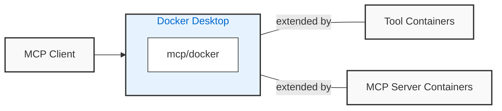

## Background

The `mcp/docker` container is an mcp server that can be extended with new
container-based tools, and prompts. Existing containers, like `curl` or `ffmpeg`, can
now be exposed as MCP servers without having to wrap each tool in an mcp server.



Definitions of new tools and prompts are made using markdown documents that can either use plain Docker
image _as_ tools, or serve requests to containerized MCP servers.

```markdown
---
tools:
  - name: curl
    description: run the curl command
    container:
      image: curl:latest
mcp:
  - container: mcp/sequentialthinking
---

# prompt

Run the curl command, in silent mode, to fetch gists for user slimslenderslacks from GitHub.
```

## Getting Started

1. [using Gordon](quickstart_gordon)
2. [using Claude Desktop](quickstart)
3. [using Cursor](quickstart_cursor)
4. [testing definitions in vscode](quickstart_vscode) using our VSCode extension. Using VSCode as an
   mcp server can provide an effective inner loop for developing the content.
