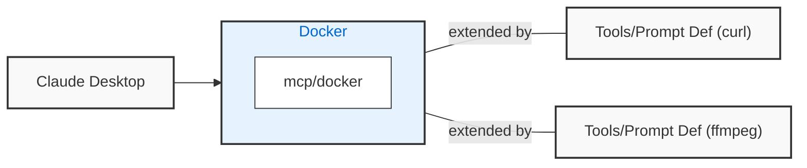

## Background

The `mcp/run` container is an mcp server that can be extended with new
container-based tools, and prompts. Existing containers, like `curl` or `ffmpeg`, can
now be exposed as MCP servers without having to wrap each tool in an mcp server.



Definitions of new tools and prompts are made using markdown documents (see [examples](examples)).

```markdown
---
tools:
  - name: curl
---

# prompt

Run the curl command, in silent mode, to fetch gists for user slimslenderslacks from GitHub.
```

## Getting Started

We can use this to extend MCP clients like Claude Desktop, and test new tool definitions using
VSCode. Instructions for these two paths are here.

1. Attach the MCP server [to Claude Desktop](quickstart).
   
   Claude Desktop has not yet implemented the `notifications/tools/list_changed`. This means that
   Claude doesn't reload our tool definitions until it is restarted. It's easier to develop
   prompts in VSCode where we can create a much more efficient inner loop.
   
2. [Test prompt definitions](quickstart_vscode) using our VSCode extension. Using VSCode as an
   mcp server can provide an effective inner loop for developing the content.
