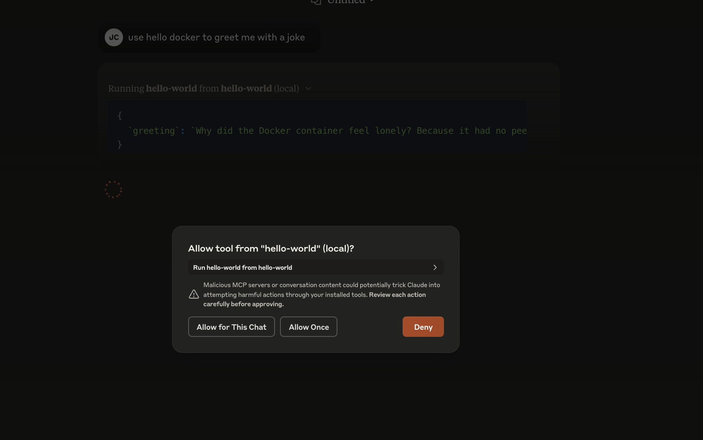

# Quickstart

Use our Docker Desktop extension to automatically register and use our tools.

[Open in Docker Desktop](https://open.docker.com/extensions/marketplace?extensionId=docker/labs-ai-tools-for-devs)
[Marketplace](https://hub.docker.com/extensions/docker/labs-ai-tools-for-devs)

# Manual Setup

Enable mcp_docker in your claude_desktop_config.json file using the following snippet.  See the [quickstart for Claude Desktop Users](https://modelcontextprotocol.io/quickstart/user) for more details.

```json

{
  "mcpServers": {
    "mcp_docker": {
      "command": "docker",
      "args": [
    	"run", "-i", "--rm", "alpine/socat", "STDIO", "TCP:host.docker.internal:8811"
      ]
    }
  }
}
```

## Adding Tools

Install the [`docker/labs-ai-tools-for-devs` extension](https://open.docker.com/extensions/marketplace?extensionId=docker/labs-ai-tools-for-devs) to
see a catalog of tools that you can install into the server.

You can also register new tool definitions by adding `--register` arguments to the above server definition.

```
        "--register", "github:docker/labs-ai-tools-for-devs?path=prompts/examples/swagger.md"
```

Learn more about the tool definitions being referenced here using the page on [authoring the tool definitions](../authoring-prompts).

## Try a sample tool

Try activating thel _hello world_ tool in our catalog (here's the [definition](https://github.com/docker/labs-ai-tools-for-devs/blob/main/prompts/examples/hello_world.md?plain=1) )
and then type "use hello docker to greet me with a joke".

You'll see a prompt asking if you want to run the "hello world" tool locally.



