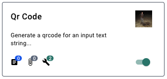
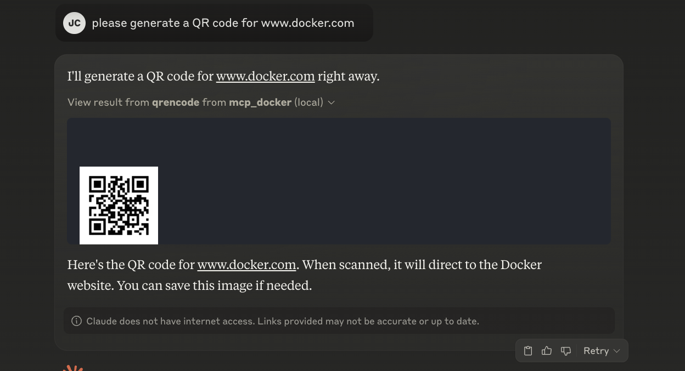

# Background

When adding the qrencode tool, the easy part was the container definition. We simply wanted to expose the cli interface of qrencode since most foundation models did not need any additional prompting to use this tool correctly. 

```yaml
tools:
  - name: qrencode
    description: use the qrencode command
    parameters:
      type: object
      properties:
        args:
          type: string
          description: The arguments to pass to qrencode
    container:
      image: vonwig/qrencode:latest
      command:
        - "{{args}}"
```

This works well but the output of qrencode is not text. It's an image of course.

## Resources

MCP also supports the creation and update of resources. In order to turn simple tools, like qrencode,
into resources, we decided to use the convention that any file written to the `/thread` volume of a tool 
container, will be turned into a resource.  However, qrencode doesn't know this convention.

Our first try at making this easier was to use a prompt.

> Run the qrencode command to generate a QR code and write it to /thread/qrcode.png

This works but the current support for custom prompts in MCP clients is limited. Users were running
the tool but we were generating tool calls that didn't know about our `/thread/` convention.

## Tool Descriptions

Every tool also has a description. If we change the above command description 
to be "generate a QR code and write it to /thread/qrcode.png", is that sufficient? Will tool calls 
try to write new images to /thread so that they'll automatically be turned into resources? This turns out
to work quite well so we've updated our tool definition. We've removed the prompt and just added a better 
tool description.

# Summary

Tool descriptions are important!

The tile in the MCP Catalog [extension](https://open.docker.com/extensions/marketplace?extensionId=docker/labs-ai-tools-for-devs) for qrencode will contribute
just one tool (the qrencode Docker image), and zero prompts. The description of the tool guides the model to 
write the tool's output in a manner that allows to recognize the creation of new resources.



This makes our prompt to generate a request to create a QR code quite simple. Here's what this looks like
in Claude Desktop.

> please generate a QR code for www.docker.com



