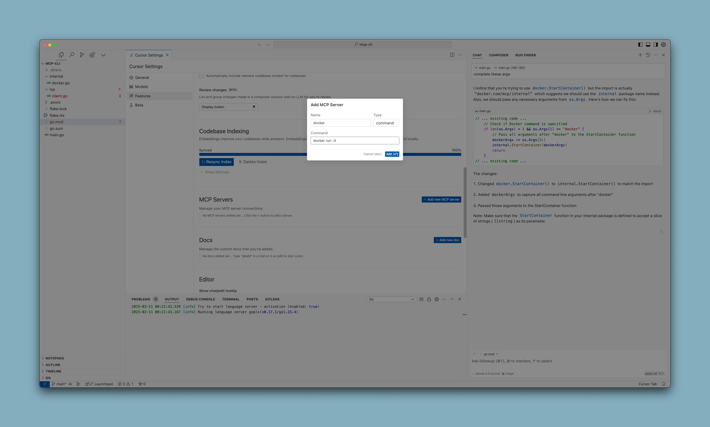
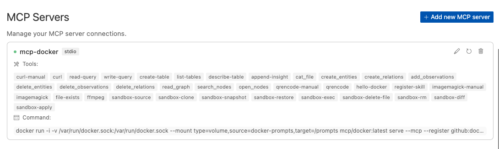
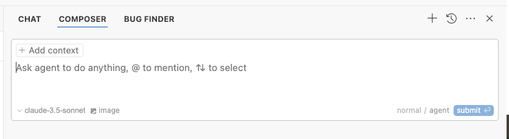

{}

### Go to Cursor Settings

Use the Features menu of the Cursor Settings
   


Choose `Command` mode and then copy and paste the following string into the field labeled "Command".

   ```
   docker run --rm -i alpine/socat:latest STDIO TCP:host.docker.internal:8811
   ```

   After entering this command, the server will start and you should see a list of available tools.

   


After updating the list of tools, users must click the refresh button to activate new tool definitions


### Use tools in agent mode of Composer

Tools will only be available in the `agent` mode of the composer. Note that the composer tab has two distinct modes (`normal` and `agent`).



{}

